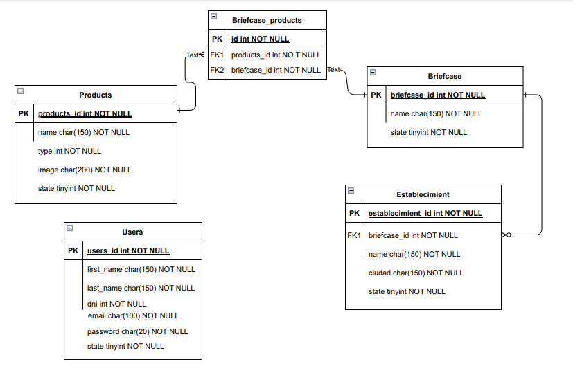

# Prueba tecnica

### Planteamiento del problema

1. Realice un diagrama Entidad-Relación donde resuelva este caso, tenga en cuenta el los
productos, el portafolio, el establecimiento y el usuario.  

2. Realizar API REST donde se puedan realizar las siguientes acciones:
    a. Creación de producto.
    b. Creación de establecimiento.
    c. Creación de portafolio.
    d. Creación de usuario.

3. Se debe hacer uso de JWT para la seguridad y manejo de sesiones, Si se va a usar otro
protocolo de seguridad y manejo de sesiones, se debe especificar y explicar.  

4. ¿Qué infraestructura utilizará para resolver este caso? (Bases de datos relacionales o
documentales, Servidores dedicados o en la nube, protocolos de comunicación).  

5. Si el servicio será utilizado por 12.000 vendedores a nivel nacional, con una disponibilidad
del 99.9999% y el servicio debe funcionar por lo menos de lunes a sábado, ¿Qué medidas
tomaría para garantizar los servicios?.

6. El servicio presentado pasa por una etapa de soporte, donde se resuelven los casos de no
reconocimiento y fallas en el servicio en la aplicación. También, se encuentra la etapa de
analítica, donde se realizan mediciones a gran nivel donde con tableros de control se
toman medidas a nivel gerencial. ¿Qué servicios o herramientas se pueden disponibilizar
para facilitar el trabajo de estas áreas?.

## Soluccion de la prueba

Acontinuacion se abjunta el diagrama ER usado en el diseño para desarrollar la ApiRest. 

El framework selecciona para esta solucion fue [FastApi](https://fastapi.tiangolo.com/), por su rapides, por su libertad al estructurar un proyecto y por su facilidad al validar y documentar una api.

Para hacer uso de este proyecto es necesario clonar el repo y crear un entorno virtual.

~~~ 
>> python -m venv venv 
~~~

Luego se necesita instalar las dependencias del proyecto listada en el archivo **requirements.txt**.

~~~
>> pip install -r requirements.txt
~~~